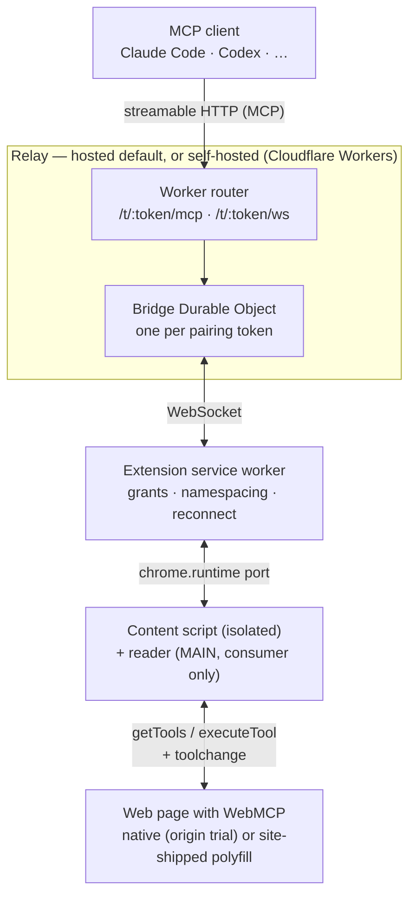

# WebMCP Cloud Relay

Bridge [WebMCP](https://github.com/webmachinelearning/webmcp) tools from your browser tabs to Claude Code, Codex, or any other MCP client. A web page registers tools with `document.modelContext.registerTool()`; you click **Connect this tab** in the extension popup; those tools show up in your agent, running inside your logged-in browser session. The only server involved is a small Cloudflare Workers relay: the extension comes pointed at the hosted instance (`relay.webmcp-cloud-relay.workers.dev`) so it works out of the box with no account, and [self-hosting](#self-hosting-the-relay) the same code is one command plus a settings field.

## How it works



The extension holds an **outbound** WebSocket to the relay, so nothing in your browser needs to be reachable from the internet. The relay's Durable Object — one per pairing token — keeps the current tool snapshot and forwards `tools/call` to the extension, which routes it to the granted tab.

The interesting part is the last hop. **The extension is a pure consumer: it never defines a web API on pages.** A page opts into WebMCP itself — either the browser ships `document.modelContext` natively (Chrome 149 has one behind an [origin trial](https://developer.chrome.com/origintrials)), or the page ships any spec-shaped polyfill, such as [GoogleChromeLabs' webmcp-polyfill](https://github.com/GoogleChromeLabs/webmcp-tools).

To consume it, the extension injects a MAIN-world _reader_: a subscriber that watches for `document.modelContext` (a page-shipped polyfill is MAIN-world JavaScript, invisible to the isolated world), listens to `toolchange`, lists tools with `getTools()`, and runs them with `executeTool()` — the spec's own caller side, so the tool always executes in the page's context. The reader relays to the isolated-world content script over `window.postMessage`; that protocol is internal to the extension, both ends being extension code. On pages without WebMCP the reader finds nothing, announces nothing, and modifies nothing.

## Features

- **Per-tab explicit grants.** Nothing is exposed by default. A tab's tools reach your agent only after you click _Connect this tab_, and the grant does not follow the tab across navigations to another origin.
- **Minimal permissions.** No host access at all: the extension injects nothing anywhere until you open its popup on a tab (`activeTab`).
- **Stable pairing URL.** The MCP endpoint is derived from a token stored in the extension, so it survives browser and worker restarts — register it with your agent once.
- **Tool namespacing by site.** `search` on `github.com` is exposed as `github_com_search`, so several connected tabs never collide.
- **Live tool set.** Registrations, revocations, and disconnects push a new snapshot and fire `notifications/tools/list_changed`; MCP clients on the SSE stream re-list automatically.
- **Cheap when idle.** The relay uses WebSocket hibernation and auto-response pings, and the extension only opens the socket while at least one tool is exposed. The flip side — an open SSE stream keeps the Durable Object active and billing — is covered in [Costs](#costs).

## Quickstart

**1. Build and load the extension** (or grab the zip from the latest [release](../../releases)):

```sh
cd packages/extension
pnpm build
```

Open `chrome://extensions`, enable **Developer mode**, click **Load unpacked**, and select `packages/extension/dist`.

**2. Copy your MCP URL.** Open the popup: it already points at the hosted relay and shows your MCP URL — `https://…/t/<token>/mcp` — masked, with a copy button and a _Reveal_ toggle. (Prefer your own relay? See [Self-hosting the relay](#self-hosting-the-relay).)

**3. Register the server with your agent.**

Claude Code:

```sh
claude mcp add --transport http webmcp <mcpUrl>
```

Codex:

```sh
codex mcp add webmcp --url <mcpUrl>
```

**4. Connect a tab.** Open a page that registers WebMCP tools, click the extension icon, and press **Connect this tab**. The badge turns green, and the tools appear in your agent (existing sessions pick them up via `tools/list_changed`).

No such page at hand? Open your relay's base URL, e.g. [relay.webmcp-cloud-relay.workers.dev](https://relay.webmcp-cloud-relay.workers.dev) — it serves `examples/demo/index.html`, which registers three note-taking tools when `document.modelContext` exists in your browser (and tells you when it doesn't). The [official demos](https://googlechromelabs.github.io/webmcp-tools/demos/pizza-maker/) also make good test targets.

## Self-hosting the relay

The hosted relay is the default for convenience, but the relay is designed to be yours: tool arguments and results pass through it in plaintext (see [Security model](#security-model)), and self-hosting removes that trust entirely. You need a Cloudflare account (the free plan is plenty — see [Costs](#costs)) and `wrangler login`:

```sh
cd packages/relay
pnpm install
pnpm run deploy
```

Wrangler prints the deployed URL, e.g. `https://relay.<your-subdomain>.workers.dev`. Paste it into the popup's _Settings → Relay base URL_; your MCP URL changes accordingly, so re-register it with your agent.

## Enabling WebMCP on your own site

Write standard WebMCP code — feature-detect and register:

```js
if (document.modelContext) {
  document.modelContext.registerTool({
    name: "add_todo",
    description: "Adds a todo item",
    inputSchema: {
      type: "object",
      properties: { text: { type: "string" } },
      required: ["text"],
    },
    execute: ({ text }) => addTodo(text),
  });
}
```

Until browsers ship the API by default, make `document.modelContext` exist on your page the way the official demos do: register for the [origin trial](https://developer.chrome.com/origintrials) for native support, and/or include a spec-shaped polyfill such as [GoogleChromeLabs' webmcp-polyfill](https://github.com/GoogleChromeLabs/webmcp-tools) (Apache-2.0). The bridge consumes whichever implementation is present — it needs the caller side (`getTools` / `executeTool` / `toolchange`) in addition to `registerTool`.

## Security model

Read this before pointing an agent at a page you do not trust. The privacy policy ([PRIVACY.md](PRIVACY.md)) covers the same ground in policy form.

- **The pairing token is a bearer capability.** Anyone holding your MCP URL can list and call the tools of every tab you have connected. Treat it like a password: the popup masks it by default, and _Settings → Regenerate token_ revokes it — tool calls through the old URL fail immediately, its remaining tool listing is dropped within a day, and every agent must be re-registered.
- **The relay sees tool traffic in plaintext.** Transport is TLS, but arguments and results are readable inside the Worker. Using the default hosted relay means trusting its operator with that visibility; [self-host the relay](#self-hosting-the-relay) to remove that trust. Either way the relay stores no account data — the Durable Object is addressed by the SHA-256 of the token, and the token itself is never persisted.
- **Tool results are untrusted page content.** Anything a page returns is attacker-controllable if the page is. Every exposed tool is annotated with `untrustedContentHint`, and the MCP server's `instructions` tell the client to treat results as data, never as instructions. Prompt injection through a hostile page is a real risk — only connect tabs you trust.
- **Explicit grants, narrow scope.** The extension has no host permissions — its scripts reach a page only when you open the popup on that tab. Only the top frame of a granted tab is bridged; iframes are not. Grants live in `chrome.storage.session`, so they are gone after a browser restart. Closing a tab or navigating it to another origin drops its grant.
- **One active tab per origin.** Granting a second tab on the same origin releases the first, which keeps tool names stable and calls unambiguous.
- **Unknown tokens still cost you requests.** Any well-formed token instantiates an (empty) Durable Object, so someone scanning your relay burns through your Cloudflare request quota — free-plan limits cap the damage, but on a paid plan consider a spend alert in the Cloudflare dashboard.

## Costs

For personal use the relay fits in Cloudflare's free plan; the Workers Paid plan ($5/month) buys headroom. The dominant charge is Durable Object **duration**: the DO is billed at 128 MB for as long as it is active, and it is active the whole time an MCP client holds the SSE notification stream open — about 450 GB-s per hour, against a free-plan limit of 13,000 GB-s/day (so even one client connected 24/7 just fits, and clients like Claude Code only connect during a session). The relay also caps this surface: at most 4 concurrent SSE streams per bridge, each living at most 2 hours (clients reconnect transparently), and streams are closed after 5 minutes without the extension connected. Everything else — MCP requests, the extension's hibernated WebSocket with its auto-response pings, the one-row tool snapshot, the static demo page, egress — is negligible or free.

## Development

```sh
pnpm install          # at the repo root
pnpm -r typecheck
pnpm -r test
```

For the relay, `cd packages/relay && pnpm dev` runs `wrangler dev` with a local Durable Object; point the extension at the printed `http://localhost:8787` to exercise the whole path. For the extension, `pnpm build` in `packages/extension` re-bundles into `dist/`; hit _Reload_ on `chrome://extensions` afterwards.

| Path                 | What it is                                                                                         |
| -------------------- | -------------------------------------------------------------------------------------------------- |
| `packages/protocol`  | Shared wire types between the extension and the relay (tool descriptors, WebSocket message union). |
| `packages/relay`     | Cloudflare Worker: MCP streamable-HTTP endpoint, `Bridge` Durable Object, extension WebSocket.     |
| `packages/extension` | Chrome MV3 extension: MAIN-world reader (consumer only), content script, service worker, popup UI. |
| `examples/demo`      | A tiny WebMCP page (three note-taking tools) to try the bridge against.                            |

## License

MIT — see [LICENSE](LICENSE).
